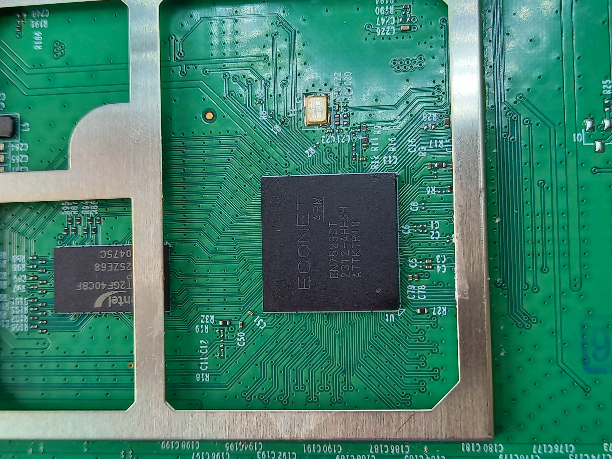
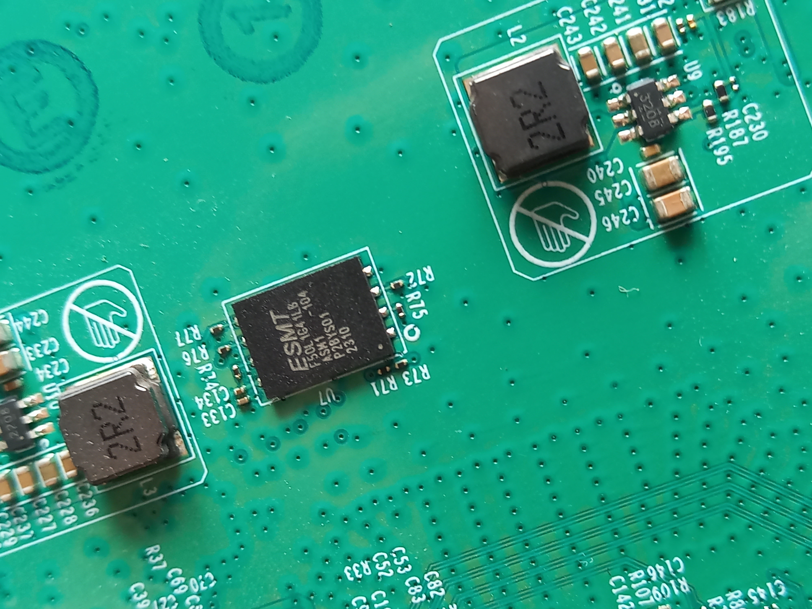
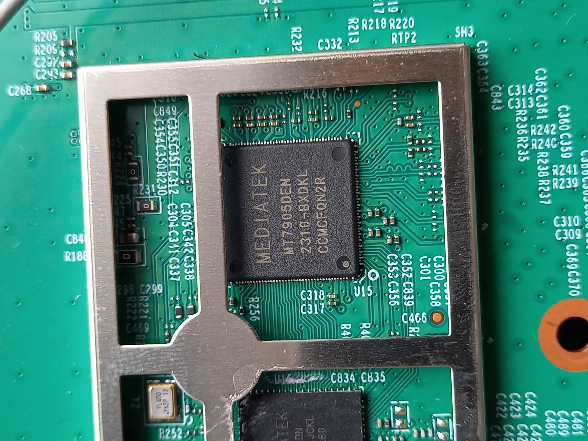
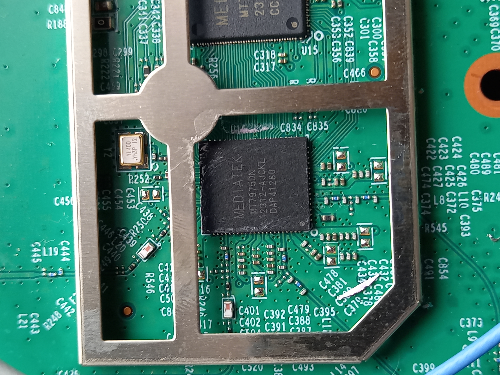
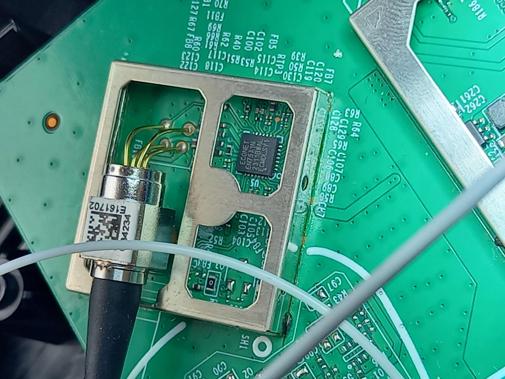
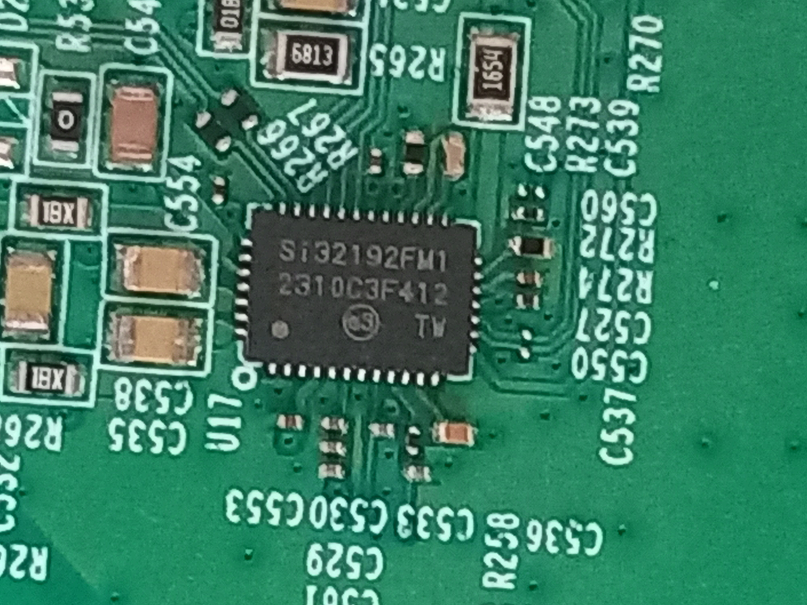
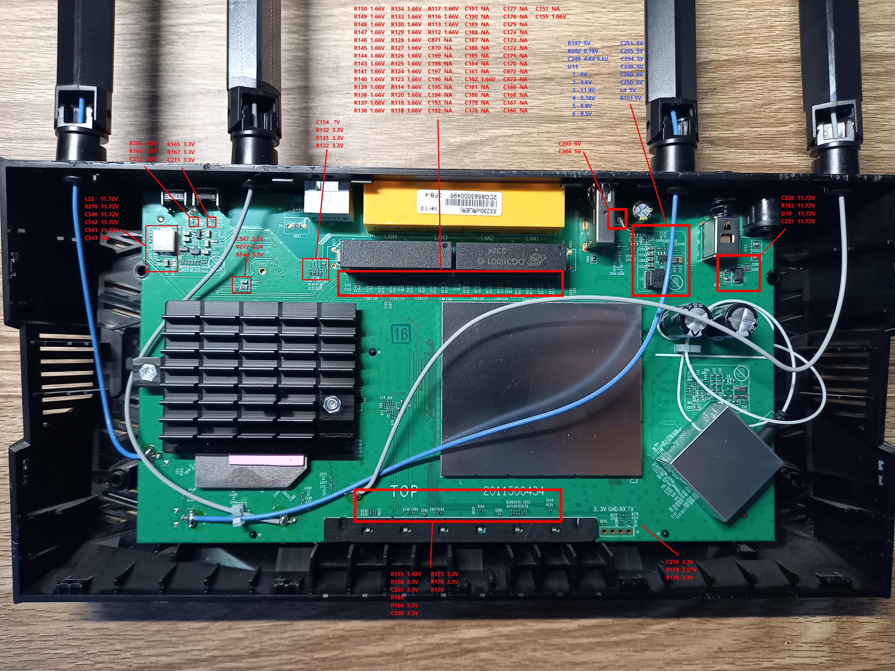
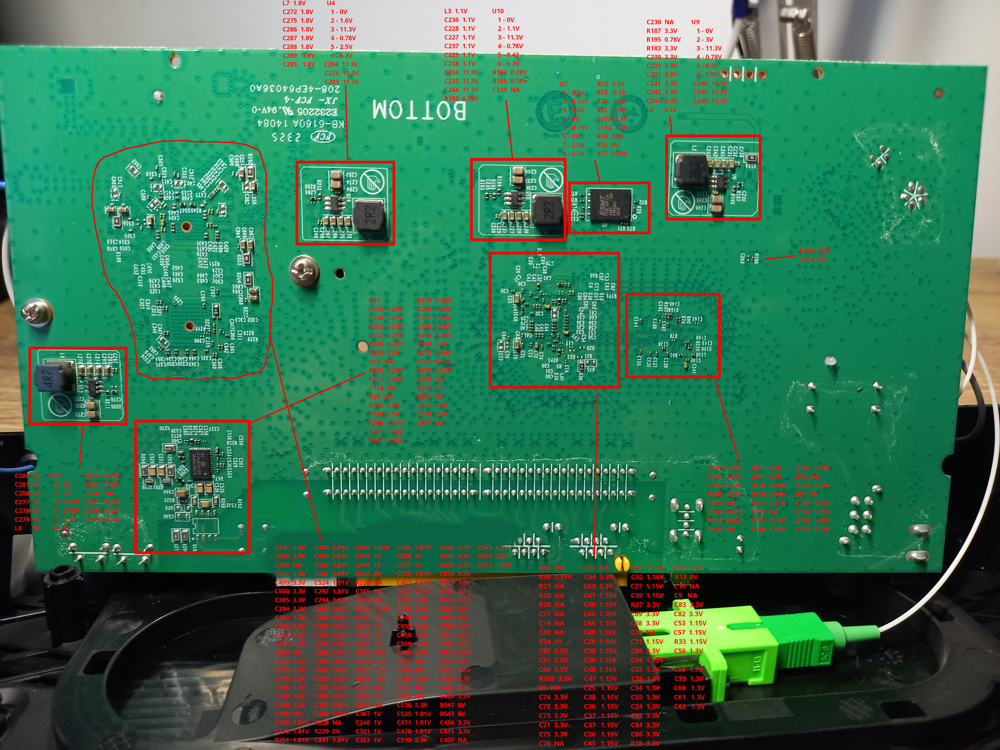

# TP-Link-XX230v-v1-Review
1. [Technical specifications](#technical-specifications)
2. [Voltage](#voltage)

# Technical specifications

CPU: ECONET ARM EN7529CT 2312-AHHSH ATTKTR10

 open image 

  

RAM: Zentel A3T2GF40CBF-HP 2325ZE68 360475C

 open image 

  

MEDIATEK MT7905DEN 2310-BXDKL CCMCFQN2R

 open image 

  

MEDIATEK MT7975DN 2312-AJCKL DAP41280

 open image 

  

xPON: ECONET EN7571N 2311BWAL ECMDKSY1

 open image 

  

Si32192-A-FM1

 open image 

# Voltage
test on openwrt, all wifi AP disabled.
 
[voltage.txt](voltage)

